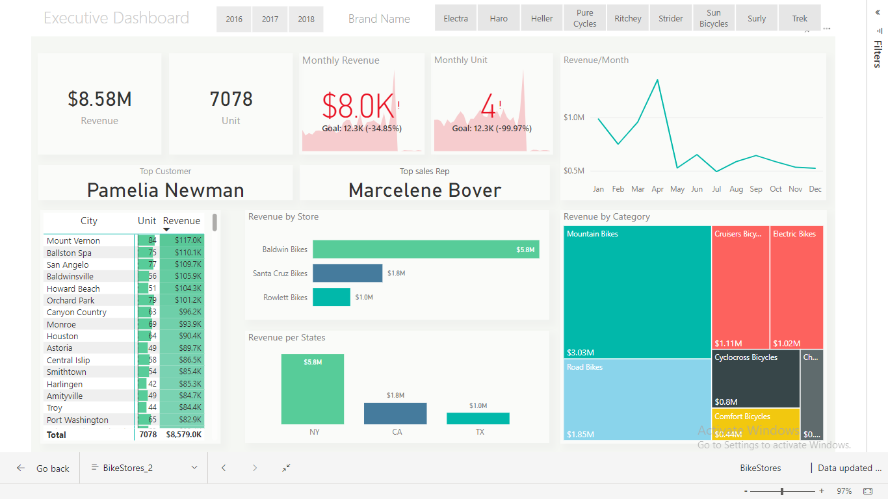
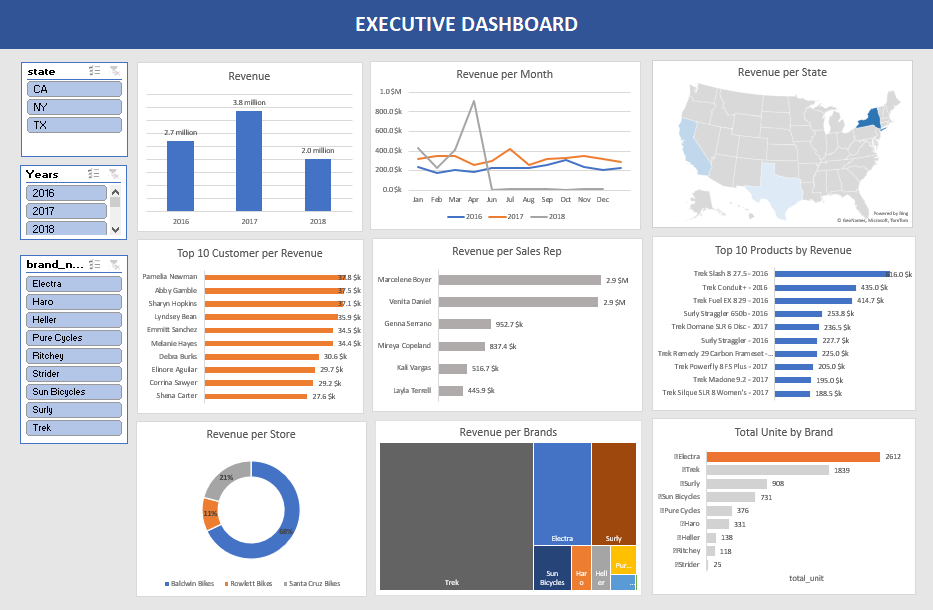

# Data Analytics Project: Executive Dashboard with SQL, Excel, and Power BI
### Power BI DashBoard Screenshort
 
 ---
 ### Excel DashBoard Screenshort
  
 
---
### Description:
This project focuses on creating an Executive Dashboard using data analytics techniques, SQL, Excel, and Power BI. The project starts with importing and cleaning nine tables in CSV format into PostgreSQL. The tables include *brands, categories, customers, orders, order_items, products, staffs, stocks, and stores.*

Once the data is cleaned and formatted, a * targeted dataset * is created using SQL scripts. This dataset includes information such as *order ID, customer details, city, state, order date, total units, revenue, product name, category name, brand name, store name, and representative name.*

---
### Problem Statements:
- Lack of centralized data visualization: Executives currently lack a centralized and visually appealing dashboard to monitor key business metrics, resulting in a fragmented understanding of the company's performance.

- Limited data-driven decision-making: Without access to meaningful insights and trends, executives face challenges in making data-driven decisions that can optimize sales, identify growth opportunities, and address performance issues.

- Inefficient data analysis and exploration: The absence of dynamic and interactive tools makes it difficult for executives to explore and analyze sales data at different levels of granularity, hindering their ability to uncover hidden patterns and trends.

- Manual data integration and reporting: Executives rely on manual processes to integrate data from multiple sources and generate reports, leading to delays, errors, and an increased risk of data inconsistencies.

---
### Skills Needed:
#### To successfully create this Executive Dashboard, the following skills are required:
- SQL: Proficiency in SQL is essential for importing and formatting the raw data, as well as performing join operations, utilizing group by and aggregation functions. These skills will enable us to combine and manipulate data from multiple tables, extract the necessary information, and generate the targeted dataset for analysis.

- Data cleaning: Strong data cleaning skills are necessary to preprocess the raw data, handle missing values, standardize formats, and ensure data integrity. This includes techniques such as data validation, data transformation, and dealing with outliers or inconsistencies in the dataset.

- Excel: A solid understanding of Excel is required for connecting the targeted dataset dynamically with Excel, creating interactive components, and designing the Excel Dashboard. Excel functions and formulas can be utilized to further analyze and manipulate the data as needed.

- Power BI: Proficiency in Power BI is essential for dynamic connections, interactive dashboard design, visualizations, filters, and drill-down capabilities. It enables advanced data modeling, visualization, and interactive reporting. Skills in calculated columns, measures, and working with time and dates enhance functionality and analysis capabilities.

- Data visualization: Knowledge of effective data visualization techniques and best practices is essential for designing visually appealing and informative charts, graphs, and other visual components within the dashboard. This includes selecting appropriate chart types, color schemes, and labeling to effectively communicate insights.

- Data analysis: A strong foundation in data analysis is beneficial for identifying meaningful metrics, trends, and patterns within the sales data, enabling executives to derive actionable insights. This involves utilizing statistical analysis techniques and data exploration to uncover key patterns and relationships in the data.

By leveraging these skills, we will be able to import and format the data, perform SQL operations such as joins, group by, and aggregations, establish dynamic connections with Excel and Power BI, design interactive visualizations, and create calculated columns and measures to enhance analysis capabilities.

---
### Included Files:
1. BikeStores.pbix: Power BI interactive dashboard.
2. BikeStores.sql: SQL script used to generate the targeted data for creating the dashboard.
3. BikeStores_Dashboard.xlsx: Excel interactive dashboard.
4. Excel_Dashboard: Screenshot of the Excel Dashboard.
5. PowerBi_Dashboard.png: Screenshot of the Power BI Dashboard.
6. raw_data: Folder containing the 9 raw tables in CSV format used in the database to generate the targeted data.

### [Click here for the Interactive DashBoard](https://app.powerbi.com/view?r=eyJrIjoiMWFiODQyZWQtMDAyNy00ZTAyLWE2MzUtNzAwNDc3MjdmZWNmIiwidCI6ImU1YzgyM2EyLTgzMDktNDNhZi1hZTIxLWI1NzE2ZTliZmQ5OSIsImMiOjEwfQ%3D%3D)

